# 🐲 Vue

### 설치

```shell
npm install -g @vue/cli
```

```shell
vue create $프로젝트명
```

```shell
npm run serve
```

### 문법

- 데이터 꽂아 넣을 때 `{{}}` 사용

- HTML 속성에 데이터 바인딩 할 때 속성 왼쪽에 `:` 삽입

- vue의 HTML 반복문

  ```javascript
  <태그 v-for="(순회 요소, index) in 반복 횟수 || 순회할 자료형 데이터" :key="key값">
  ```

- vue에서 이벤트 바인딩할 때 `@이벤트명=""` 방식으로 사용

  ```javascript
  ex) @click="", v-on:click="" // 둘다 똑같다 @는 v-on의 축약형
  ```

- vue는 데이터가 변하면 관련된 HTML은 바로 반영되어 자동으로 바뀜

- vue에서 사용할 데이터들은 `data()` 메서드의 반환하는 객체에 세팅

- vue에서 함수를 선언하려면 `methods` 속성에 함수를 선언

  ```javascript
    // 데이터 보관함
    data() {
      return {
        products: [
          { room: '역삼동 원룸', price: 50, declaration: 0 },
          ...
        ],
      };
    },
    // 함수 선언하는 공간
    methods: {
      increase(i) {
        /**
         * vue에서 함수 선언할 때 주의사항
         * - 함수 안에서 data 사용할 때 this를 사용해 접근
         */
        this.products[i].declaration += 1;
      },
    },

  ```

- vue 조건문

  ```javascript
  // 값이 truthy, 조건식이 true일 때만 해당 HTML 보여줌
  <div v-if="조건식">안녕하세요</div>
  ```

  ```javascript
  <>
    <div v-if="1 === 2">안녕하세요</div>
    // v-else 위에 있는 v-if가 참이 아니면 이걸 보여주세요~
    <div v-else>바이바이</div>
  </>
  ```

  ```javascript
  <>
    <div v-if="number === 1">안녕하세요1</div>
    // if문 연달아 여러개 쓰고싶을 경우 v-else-if
    <div v-else-if="number === 2">안녕하세요2</div>
  </>
  ```

### 동적인 UI 만드는 법

```
0. UI를 미리 만들어두고
1. UI의 현재 상태를 데이터로 저장해둠
2. 데이터에 따라 UI가 어떻게 보일지 작성
```

- 페이지 시작시 자동 실행 함수 `mounted()`

  ```javascript

  export default {
    name: 'App',
    // 페이지 시작시 자동 함수 실행
    mounted() {
      this.getDate().then((res) => {
        this.products = res.map((data) => {
          return { ...data, declaration: 0 };
        });
      });
    },
    ...
    }

  ```

#### vue 컴포넌트 만들기

```
1. vue파일 만들기
2. <template>에 축약할 HTML 넣기
3. name속성 설정하기
```

- 만든 컴포넌트 쓰는 법

  ```
  1. vue 컴포넌트 파일 import 해오고
  2. components: {} 에 속성으로 등록하고
  3. <쓴다/>
  ```

- 컴포넌트 사용 이유

  - 재사용성
  - 코드 가독성

- (업데이트사항) 이제 컴포넌트.vue 이름은 귀찮게 2단어 이상으로 작명해야합니다 안그러면 에러로 잡아줌

  DiscountBanner.vue 이런 식으로 2단어로 작명 잘하면 됩니다.

  싫으면 package.json 파일 열어서 "rules" 라는 항목에

  ```json
  "rules": {
    "vue/multi-word-component-names": "off"
  }
  ```

- `{{데이터바인딩}}`은 밑에 해당 data가 있어야 가능함

#### props

- 데이터는 한 곳에 보관함(보통 `App.vue` 컴포넌트 이런곳에)
  그리고 필요하면 props로 전달 받아서 가져다 씀

- 부모/자식 컴포넌트

  - 상위 `App.vue` 컴포넌트는 **부모 컴포넌트**에 해당
  - 하위 `Modal.vue` 컴포넌트는 **자식 컴포넌트**에 해당  
    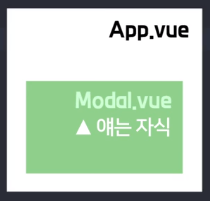

- 자식 컴포넌트가 부모가 갖고 있는 데이터를 쓰려면
  **props**로 부모가 갖고 있는 데이터를
  자식 한테 전송해야함

- **props**로 자식에게 데이터 보내는 법 1.데이터 보내고, 2.등록하고, 3.쓰셈

  - step 1. 밑에 데이터 골라서 보내셈

    - vue에서 `:` 의 역할은 두 가지
    - 클래스명 html의 기본 속성(attribute)에 데이터 바인딩할 때
    - 자식 컴포넌트에 데이터 **props**로 전송할 때 `v-bind`와 동일한 문법

    ```javascript
    <자식 :데이터="데이터">

    <Modal :products="products" :modalState="modalState" :targetNum="targetNum" />
    ```

  - step 2. 자식은 **props**로 받은거 등록

    ```javascript
    export default {
      name: 'Modal',
      /* 
      props: {
        데이터이름: 자료형이름,
      },
      */
      props: {
        products: Object,
        modalState: Boolean,
        targetNum: Number,
      },
    };
    ```

  - step 3. 쓰셈

    ```html
    <div class="modal" v-if="modalState">
      <div class="white-bg">
        <!-- 데이터에서 targetNum속성 값에 해당하는 index 요소에 접근해 각 속성을 바인딩 -->
        <h4>{{ products[targetNum].title }}</h4>
        
        <p>{{ products[targetNum].content }}</p>
        <span>가격 : {{ products[targetNum].price }} 원</span>

        <!-- Custom Event : 부모한테 메세지 보냄, this.$emit('작명',데이터); -->
        <button type="button" @click="$emit('openModal', false)">닫기</button>
      </div>
    </div>
    ```

  - (주의) props는 read-only임 받아온거 수정하면 큰일남

    ```html
    <!-- pops로 받아온 modalState를 조작하려고 함 !! -->
    <button type="button" @click="modalState = false;">닫기</button>
    ```

  1 . 부모 데이터를 자식이 쓰고싶을 때 쓰는게 props
  2 . props 전송하려면 위에 3-step 절차로 진행
  3 . props로 받아온건 read-only라서 조작 불가

  재사용성을 고려해서 컴포넌트를 제작

- 데이터 저장 팁

  Q. 애초에 자식에서 해당 데이터를 쓸거면
  자식 컴포넌트에다가 만들어도 되잖음?
  A. 그래도 되긴 한데 해당 데이터가
  **부모도 쓰는 데이터라면**
  부모 컴포넌트에 데이터를 만들어두셈  
  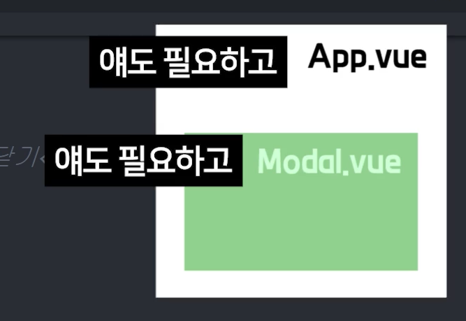

  데이터를 하위 컴포넌트에다가 만들어도 상관은 없다.
  그런데 데이터를 쓰는 곳이 여러군데다?

  그 여러군데 중에서 최상위 컴포넌트에 만드셈  
  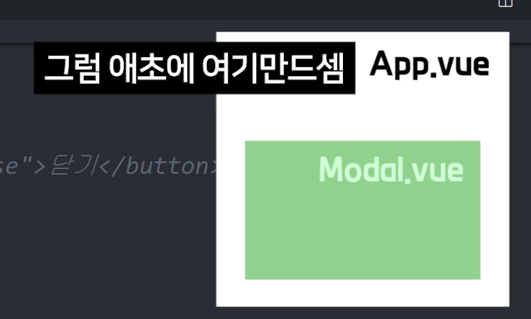

  왜냐하면 데이터는 위로 전송하는 건 어렵다.

  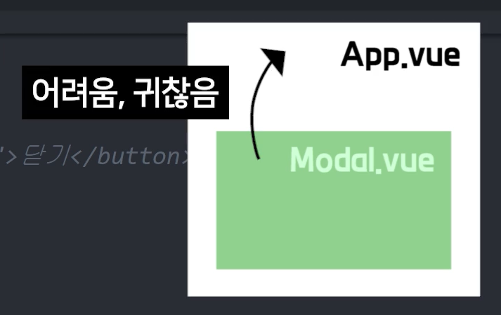

  밑으로 전송하는 것은 props로 전송하면 되므로 간단하다.  
  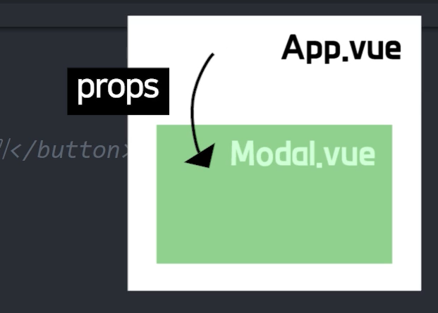

  **데이터 만들땐 해당 데이터를 많은 컴포넌트들이 쓴다면 데이터 사용하는 곳들 중 최상위 컴포넌트에 만드셈 그래야 props로 쉽게 전송가능**

<br>

- Q. 애초에 Modal.vue에다가 원룸들, 누른거 이런거 데이터 저장해두면 안되나?

  ```
    props가 귀찮기 때문에

    App.vue에다가 만들지말고 애초에 Modal.vue 파일에다가 data(){} 열고

    여기에 데이터들 저장해놓고 쓰면 안되냐는 소리입니다.

    내가 이 데이터를 Modal.vue 안에서만 쓸 거라고 자신하면 거기다가 만드셔도 됩니다.

    하지만 데이터를 만들 때 원칙이 있는데

    "데이터를 사용하는 컴포넌트들 중 최상위 컴포넌트에다가 데이터를 만들어놔야함"

    이걸 지켜서 만들어주시길 바랍니다.

    왜냐면 데이터는 위로 전송하는게 복잡하고 추적이 어렵기 때문입니다.

    귀찮으면 그냥 모조리 App.vue에 저장해놓으셈 그것도 나쁘지 않습니다.
  ```

- props 보낼 때 다양한 자료형 입력가능

  Array, Object  
  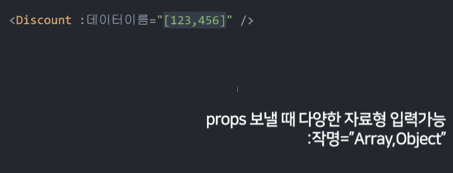

  Number, String  
  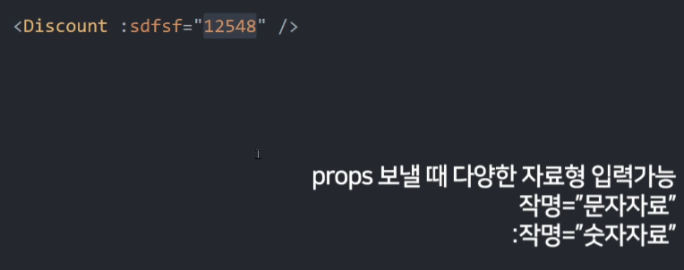

- v-bind로 객체로 묶어서 한번에 props 전송하기

  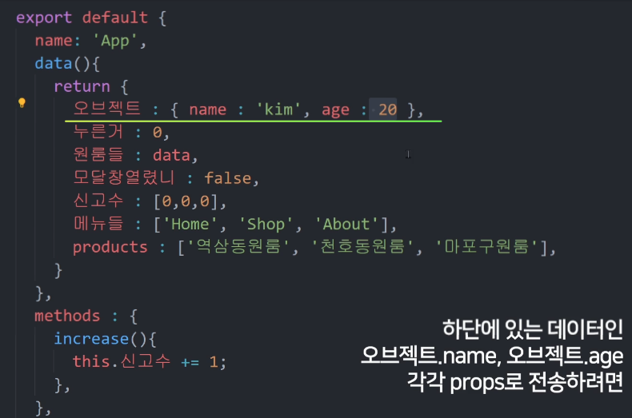

  다음과 같이 각 속성들 따로 따로 props로 전달할 필요 없이
  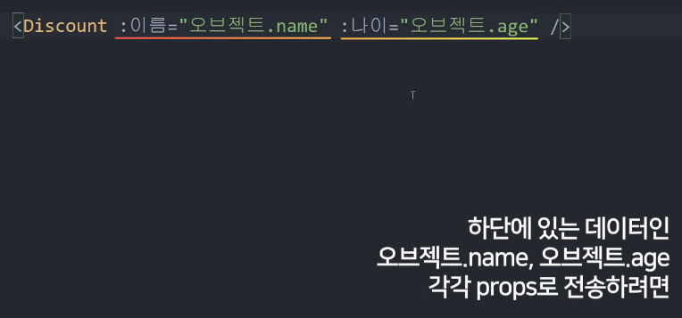

  `v-bind` 속성을 사용해 객체로 묶어서 props전송
  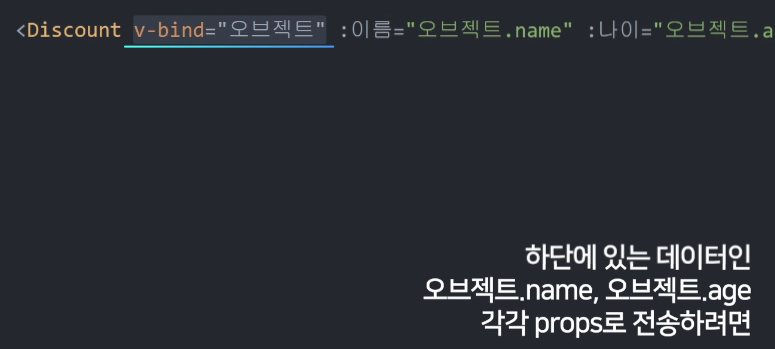

  객체에 있는 속성을 하나하나 일일히 꺼내서
  props로 보낼 필요 없이 `v-bind`속성을 사용해
  전송할 속성들을 객체로 묶어서 props로 전송해준다.

  ```javascript

  // before, props로 전송할 속성들을 각각 보냄
  <Modal :products="products" :modalState="modalState" :targetNum="targetNum" />

  // after, props로 전송할 속성들을 v-bind로 객체로 묶어서 보냄
  <Modal v-bind="{ products, modalState, targetNum }" />
  ```

#### 자식이 부모데이터 바꾸고 싶으면 custom event

- 부모로 부터 전달받은 props 데이터는 **read-only(읽기 전용 데이터)**라서 조작, 수정이 불가능해서 제약사항이 있었다.  
  부모에게 전달받은 데이터를 수정하게 되면 부작용 사항이 생김  
  

- 정확하게 말하자면 전달 받은 props가 아니라
  부모에 있는 데이터를 수정하고 싶다면?
  **custom event**를 사용해야한다.
  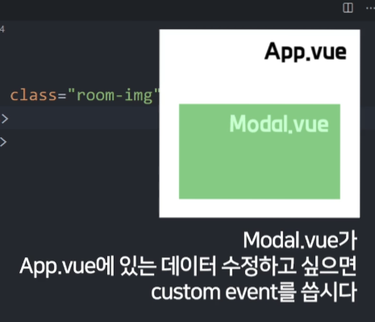

  자식은 부모가 가진 데이터를 수정할 수 없다.
  그래서 그냥 메세지를 보내는거  
   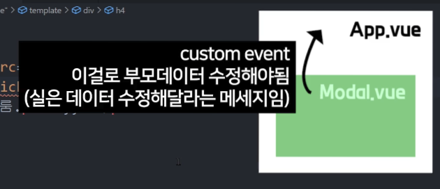

- 부모한테 메세지를 보내는 방법
  ($어쩌구는 Vue만의 특별한 변수)

  ```javascript
  // 부모한테 메세지를 보냄
  $emit('작명', 데이터);
  ```

  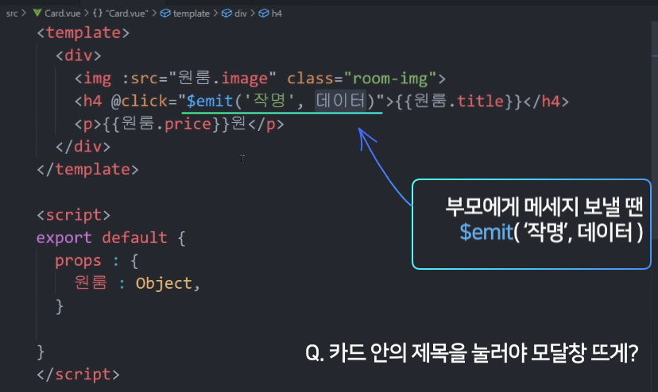

  - **Card.vue**

  ```html
  <!-- custom event -->
  <button type="button" @click="$emit('increase', i)">허위매물 신고</button>
  <button type="button" @click="$emit('openModal', true)">상세 페이지 보기</button>
  ```

  - **Modal.vue**

  ```html
  <!-- Custom Event : 부모한테 메세지 보냄, this.$emit('작명',데이터); -->
  <button type="button" @click="$emit('openModal', false)">닫기</button>
  ```

- 부모가 메세지 수신할 때  
  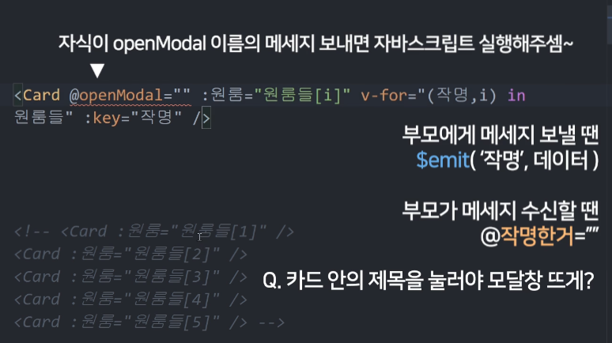

  - **App.vue**

  ```html
  <!-- custom event로 자식 컴포넌트에서 $emit호출로 인해 메세지가 수신되면 부모에서 해당 커스텀 이벤트 핸들러를 호출  -->
  <!--custom event의 $event 변수에 $emit()의 두번째 인자로 전달된 값이 들어온다. -->
  <Modal @openModal="modalState = $event" v-bind="{ products, modalState, targetNum }" />
  ...
  <!-- data의 product를 for문으로 루프 돌리고 순회 요소, index인 itme, i 를 v-bind속성을 사용해 묶어서 props로 전달. -->
  <!-- custom event로 자식 컴포넌트에서 $emit호출로 인해 메세지가 수신되면 부모에서 해당 커스텀 이벤트 핸들러를 호출  -->
  <!--custom event의 $event 변수에 $emit()의 두번째 인자로 전달된 값이 들어온다. -->
  <Card
    @openModal="modalState = $event"
    @increase="products[$event].declaration++;
  "
    v-for="(item, i) in products"
    :key="item.id"
    v-bind="{ item, i, activeModal }"
  />
  ```

- 부모가 가지고 있는 데이터를 자식이 직접 조작할 수 없으니
  부모한테 메세지(`$emit('작명', 데이터)`)를 보냄
  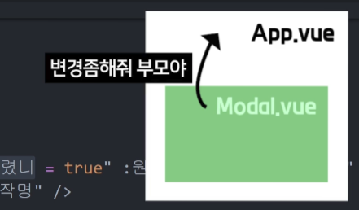

- 자식이 보낸 데이터는 커스템 이벤트의 `$event`변수에 담겨있음  
  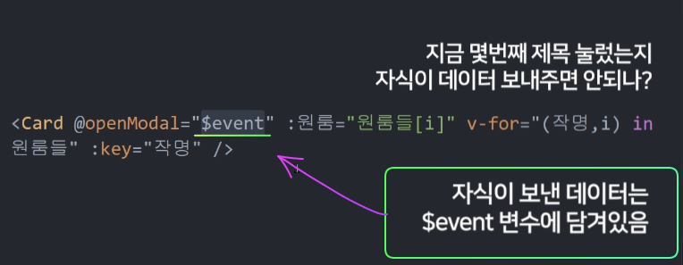

1. 자식이 부모 App.vue에 있는 데이터 변경하고 싶은뎅
2. 변경해달라는 메세지만 보냄(custom event 문법으로), 메세지와 함께 데이터도 같이 보내기 가능
3. 부모에게 메세지 보낼 땐 `$emit('작명', 데이터)`
4. 부모가 메세지 수신할 땐 `<자식컴포넌트 @작명한거="">`  
   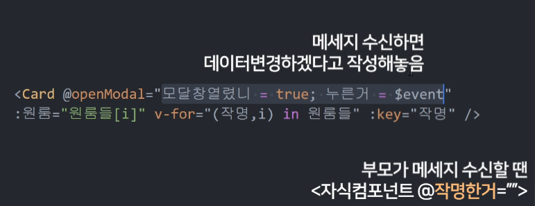
5. `$emit()`을 함수, methods 안에서 사용하려면 `this.$emit()`으로 접근
   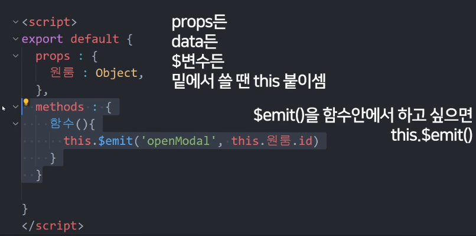
